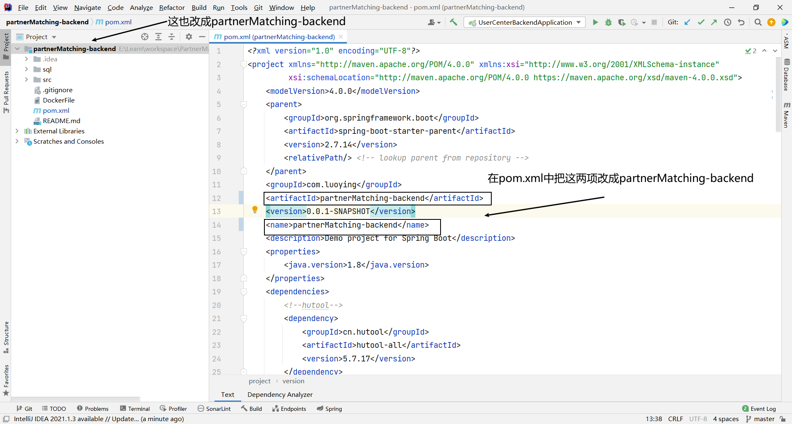

# 樱络 - 伙伴匹配系统

简介:帮助大家找到志同道合的伙伴，移动端的H5网页（尽量兼容PC端）

用户可以去用户中心注册，登录用户中心，每个用户可以打上一些标签，伙伴匹配系统根据标签帮家找到志同道合的伙伴

## 需求分析

1. 用户给自己添加标签；修改标签，系统根据标签对用户进行分类（有哪些标签，如何对标签进行分类）分类比如：学习方向，就业状态，理想城市，工作，大学等
2. 主动搜索：允许用户根据标签去搜索其他用户
   1. 把需要被搜索的数据加到Redis缓存

3. 组队（前端的同学想找后端的同学帮助自己完成后端，后端的同学也需要前端的同学帮助自己完成前端，需要帮助的同学就可以创建一个队伍，等待有缘人，只能由一方单向发起组队）
   1. 创建队伍
   2. 加入队伍
   3. 根据标签查询队伍
   4. 删除队伍
   5. 编辑队伍
   6. 邀请其他人
   7. 队伍人数由上限，但为了防止有人放鸽子，可以多加几个人作为替补

4. 推荐相似伙伴
   1. 使用相似度计算算法　＋　本地分布式（采用多线程）


## 技术选型

### 前端

1. Vue3框架（提高页面开发效率）
2. Vant3 UI组件库（基于Vue的移动端组件库）（它也有基于React的版本Zent）
3. Vite4（打包工具，速度快）
4. Nginx 单机部署

### 后端

1. Java8 （编程语言）
2. Spring（依赖注入框架，管理Java对象，集成一些其他内容） 
3. SpringMvc （Web框架，提供接口访问，restful接口等能力）
4. Mybatis（Java操作数据库的框架，持久层框架，对JDBC的封装） 
5. Mybatis-Plus（对mybatis的增强，不用写SQL也能实现增删改查） 
6. SpringBoot（快速启动/快速集成项目，帮助管理Spring的配置，帮助整合框架） 
7. MySQL（数据库）
8. Redis（缓存，NoSQL）
9. Swagger + Knife4j 接口文档


## 计划

1. **前端项目初始化**
2. **前端主页 + 组件概览**
3. **数据库表设计**
   1. 标签表
   2. 用户表
4. **后端项目初始化**
5. **后端开发**
   1. 使用标签搜索用户
   2. 整合Swagger + Knife4j 接口文档
   3. 存量用户信息导入及同步（爬虫）
   4. 组队
   5. 用户修改
   6. 推荐
6. **前端开发**
   1. 整合路由
   2. 搜索页面-根据标签搜索用户
   3. 用户信息页
   4. 用户信息修改页


## 前端项目初始化

**文档介绍**


### 脚手架初始化项目

使用[ Vue CLI ](https://cli.vuejs.org/zh/)或者[Vite 官方](https://cn.vitejs.dev/guide/)

本项目使用Vite


```
yarn create vite
```


```sh
#安装依赖
npm install
```


### 整合Vant组件库

1. 安装vant


```
npm i vant
```

2. 安装插件

```sh
#它可以自动引入组件，并按需引入组件的样式。
npm i vite-plugin-style-import@1.4.1 -D
```

3. 让Vite认识Vant-在vite.config,ts中修改代码

```ts
import { defineConfig } from 'vite'
import vue from '@vitejs/plugin-vue'
import styleImport,{ VantResolve } from 'vite-plugin-style-import';
// https://vitejs.dev/config/
export default defineConfig({
  plugins: [vue(),styleImport({
    resolves:[VantResolve()],
    libs: [
      {
        libraryName: 'vant',
        esModule: true,
        resolveStyle: (name) => `../es/${name}/style`
      }
    ]
  }),],
})
```

4. 引入组件


5. 修改main.ts文件

```ts
//不用多引入样式
import { createApp } from 'vue'
import App from './App.vue'
import {Button, NavBar} from "vant";

const app=createApp(App)

app.mount('#app')
```

## 前端主页 + 组件概览

**开发页面经验**：

1. 多参考
2. 从整体到局部
3. 先明确页面的布局，再写代码

**精简页面**


### 页面设计

1. 导航条：展示当前页面名称
2. 主页搜索框 ==> 搜索页（标签筛选页，通过标签筛选用户）==> 搜索结果页
3. 内容：

2. Tab栏
   - 主页（推荐页 + **广告**）
     - 搜锁框
     - banner
     - 推荐信息流
   - 队伍
   - 用户页（消息-暂时考虑发邮件）

### 组件概览

1. 导航栏

   

2. TabBar

   

3.  

### 开发

#### 通用布局

1. 抽象一个通用的布局（Layout），使得其他页面能够复用布局中的组件/样式，利于维护


2. 复制导航栏的代码到这个布局中


3. 在App.vue中添加布局


4. 在main.ts中引入NavBar,Icon


5. 对导航栏进行修改


6. 引入TabBar


7. 效果


## 数据库表设计

### 新增标签表

**标签**：

性别：男，女

方向：Java，C++，Go，前端，后端

目标：考研，春招，秋招，社招，考公，竞赛，转行，跳槽

段位：初级，中级，高级，码神

身份：小学，初中，高中，大一，大二，大三，大四，学生，待就业，已就业，研一，研二，研三

状态：乐观，聒噪，狂热，一般，单身，已婚，有对象

用户自己定义标签：开发者不可能想到所有用户需要的标签，让用户去决定要右哪些标签

**字段**：

id   		   bigint          主键 	

tagName vachar  	 非空标签名（标签具体内容，比如男）（唯一索引）

userId 	 bigint 		上传标签的用户 （用户可以自定义标签，然后上传） （普通索引，根据userId查询已上传的标签）

parentId  bigint 		父标签id (就是标签的抽象，比如性别)

isParent   tinyint   	是否为父标签（0-不是，1-是） 

createTime datetime 创建时间

updateTime datetime 更新时间

isDeleted tinyint		 逻辑删除(0-未删除，1-已删除)

通过父标签id来分组 

```mysql
DROP TABLE IF EXISTS tag;

create table user_center.tag
(
    id         bigint auto_increment comment '(主键) '
        primary key,
    tagName    varchar(256)                       null comment '标签名称',
    userId     bigint                             null comment '用户id',
    parentId   bigint                             null comment '父标签id',
    isParent   tinyint                            null comment '0-不是父标签，1-是父标签',
    createTime datetime default CURRENT_TIMESTAMP not null comment '用户创建时间',
    updateTime datetime default CURRENT_TIMESTAMP not null on update CURRENT_TIMESTAMP comment '用户更新时间',
    isDeleted  tinyint  default 0                 not null comment '标签是否已删除',
    constraint uniIdx_tagName
        unique (tagName)
)
    comment '标签表';

create index Idx_userId
    on tag (userId);
```


### 修改用户表

**根据自己的需求！！！**

1. 直接在用户表补充tags字段，['Java','男'] Json（**采用**）

   优点：查询方便，不用新建关联表，标签是用户的固有属性（除了该系统，其他系统可能也会用到），节省开发成本。可以用缓存，提高用户查询性能

   缺点：用户表多一列

2. 加一个关联表，记录用户和标签的关系（**尽量减少关联查询**）

   优点：查询灵活，可以正查反查

   缺点：查询100个用户的列表时，查完用户表得到用户id，又要根据用户id查关联表获取标签id，又要根据标签id查标签表获取标签，影响扩展和查询性能

**用户表**：

- id  （主键）bigint
- userAccount 登录账号 varchar
- username 用户昵称 varchar
- avatarUrl 用户头像 varchar
- gender 用户性别 tinyint 0 1
- userPassword 用户密码 varchar
- phone 用户电话 varchar
- email 用户邮箱 varchar
- userStatus 用户状态 int  0-正常 
- createTime 用户创建时间 datetime
- updateTime 用户更新时间 datetime
- isDeleted 用户是否删除(逻辑删除) tinyint 0 1
- userRole 用户角色 

```mysql
DROP TABLE IF EXISTS user;

create table user_center.user
(
    id           bigint auto_increment comment '(主键) '
        primary key,
    userAccount  varchar(256)                       null comment '登录账号',
    username     varchar(256)                       null comment '用户昵称',
    avatarUrl    varchar(1024)                      null comment '用户头像',
    gender       tinyint                            null comment '用户性别',
    userPassword varchar(256)                       not null comment '用户密码',
    phone        varchar(128)                       null comment '用户电话',
    email        varchar(512)                       null comment '用户邮箱',
    userStatus   int      default 0                 not null comment '用户状态 0-正常 ',
    createTime   datetime default CURRENT_TIMESTAMP not null comment '用户创建时间',
    updateTime   datetime default CURRENT_TIMESTAMP not null on update CURRENT_TIMESTAMP comment '用户更新时间',
    isDeleted    tinyint  default 0                 not null comment '用户是否删除',
    userRole     int      default 0                 not null comment '用户角色 0-普通用户 1-管理员',
    authCode     varchar(512)                       null comment '付费系统编号，用于校验用户'
    
)
    comment '用户表';
#补充tags字段    
alter table user add COLUMN tags varchar(1024) null comment '标签列表Json'
```

## 后端项目初始化

本来想把标签的增删改查等业务放到新项目里，实际分析后，因为标签和用户关联比较强，所以还是把标签的增删改查放到用户中心项目里

1. 把用户中心项目后端代码复制，目录改成partnerMatching-backend，删掉.idea，iml文件；修改pom.xml文件



## 用户中心提供用户的查询，操作，注册，登录，鉴权


## 后端开发

### 使用标签搜索用户

建议通过实际测试来分析哪种查询比较快，数据量大的时候验证效果更明显！

- 如果参数可以分析，根据用户的参数去选择查询方式，比如标签数。标签数少，用SQL查询；标签数多，用内存查询

- 如果参数不可分析，并且数据库连接足够、内存空间足够，可以并发同时查询，谁先返回用谁。
- 还可以 SQL 查询与内存查询相结合，比如先用 SQL 过滤掉部分 tag

**SQL查询**

1. 允许用户传入多个标签，多个标签在用户的tags字段都存在，用户才能被搜出来 

   ```
   tags like '%Java%' and  tags like '%C++%' and tags like '%Go%'
   ```

2. 允许用户传入多个标签，任何标签在用户的tags字段存在，用户就能被搜出来

   ```
   tags like '%Java%' or  tags like '%C++%' or tags like '%Go%'
   ```

```java
/**
 * 使用标签搜索用户（SQL查询版）
 *
 * @param tagList 用户传入的标签
 * @return
 */
@Deprecated
public List<UserDTO> queryUsersByTagsBySQL(List<String> tagList) {
    //判空
    if (CollectionUtil.isEmpty(tagList)) {
        throw new BusinessException(ErrorCode.PARAMS_ERROR, "标签不能为空");
    }
    //SQL模糊查询
    LambdaQueryWrapper<User> queryWrapper = new LambdaQueryWrapper<>();
    for (String tag : tagList) {
        queryWrapper.like(StringUtils.isNotBlank(tag), User::getTags, tag);
    }
    List<User> users = userMapper.selectList(queryWrapper);
    //脱敏
    return users.stream().map(user -> BeanUtil.copyProperties(user, UserDTO.class)).collect(Collectors.toList());
}
```

**内存查询**

1. 在用户中心的UserServiceImpl中提供queryUsersByTagsByMemory接口

```java
/**
 * 使用标签搜索用户(内存过滤）
 *
 * @param tagList 用户传入的标签
 * @return
 */
@Override
public List<UserDTO> queryUsersByTagsByMemory(List<String> tagList) {
    //判空
    if (CollectionUtil.isEmpty(tagList)) {
        throw new BusinessException(ErrorCode.PARAMS_ERROR, "标签不能为空");
    }
    //内存查询
    LambdaQueryWrapper<User> queryWrapper = new LambdaQueryWrapper<>();
    //查询所有用户
    List<User> users = userMapper.selectList(queryWrapper);
    Gson gson = new Gson();
    return users.stream().filter(user -> {
        Set<String> tempTagSet = gson.fromJson(user.getTags(), new TypeToken<Set<String>>() {
        }.getType());
        //有些用户的tags字段可能为空，要先判空，否则报控空指针异常
        tempTagSet = Optional.ofNullable(tempTagSet).orElse(new HashSet<>());
        //过滤
        for (String tag : tagList) {
            if (!tempTagSet.contains(tag))
                return false;
        }
        return true;
    }).map(user -> BeanUtil.copyProperties(user, UserDTO.class)).collect(Collectors.toList());
}
```

2. 因为user表加了字段，相应的做些修改


### 组队

### 用户修改

### 推荐


## 前端开发

### 整合路由

Vue-Router 其实就是帮助你根据不同的 url 来展示不同的页面（组件），不用自己写 if / else

路由配置影响整个项目，所以建议单独用 config 目录、单独的配置文件去集中定义和管理。

有些组件库可能自带了和 Vue-Router 的整合，所以尽量先看组件文档、省去自己写的时间。

[安装 | Vue Router (vuejs.org)](https://router.vuejs.org/zh/installation.html)

1.安装Vue Router

```sh
#如果安装失败，可能是项目正在运行，把项目停掉，删除node_modules目录，再安装
yarn add vue-router@4
```


2. 引入vue-router

[入门 | Vue Router (vuejs.org)](https://router.vuejs.org/zh/guide/)


3. 修改通用布局

   

   编程式路由参考[编程式导航 | Vue Router (vuejs.org)](https://router.vuejs.org/zh/guide/essentials/navigation.html)

### 搜索页

1.选择组件


2. 引入组件


3. 编写搜索页

   1. 编写导航栏

      

      

      

   2. 分割已选标签和选择标签

      

   3. 渲染已选标签

      

      

   4. 引入TreeSelect组件

      

      

   5. 添加搜素页的路由

      

   6. 最终效果

      

### 用户信息页

把用户数据库中的用户信息展示到这个页面

1. 选择组件

   

2. 编写用户类型-方便接受后端的数据

   

3. 引入组件

   

   

   

4. 效果

   

### 用户信息修改页

