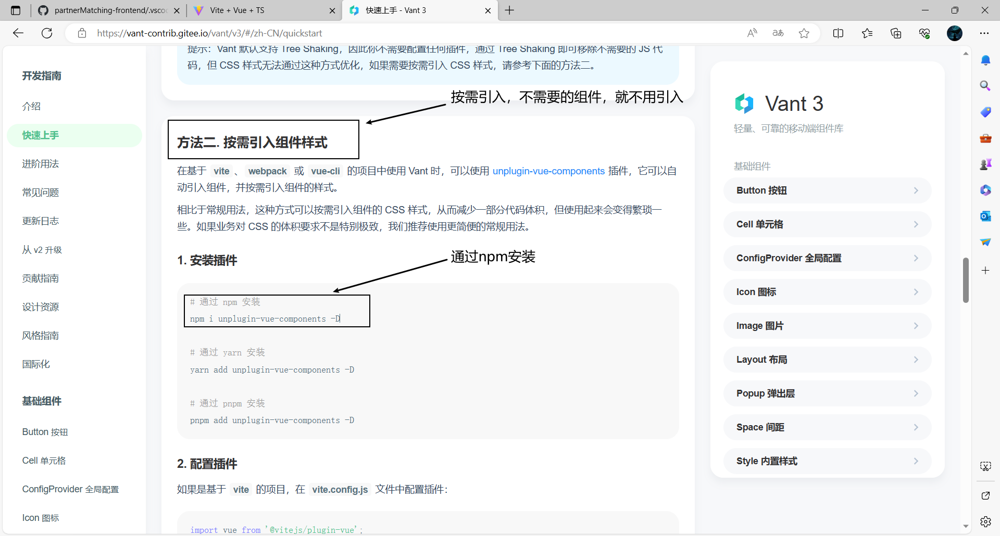
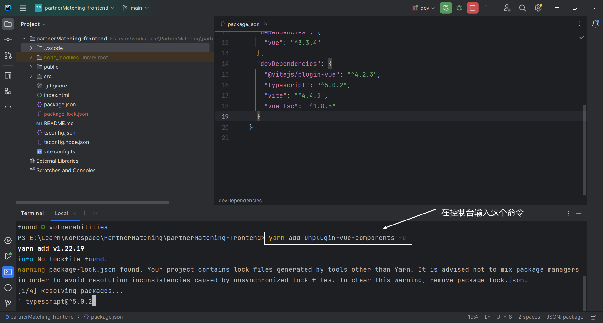
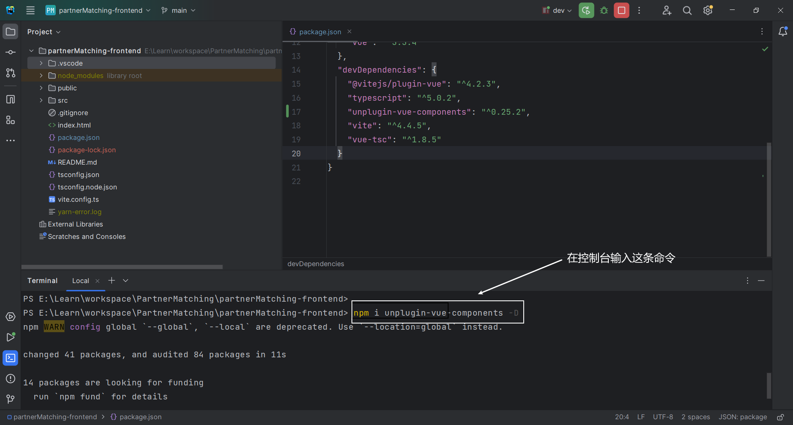
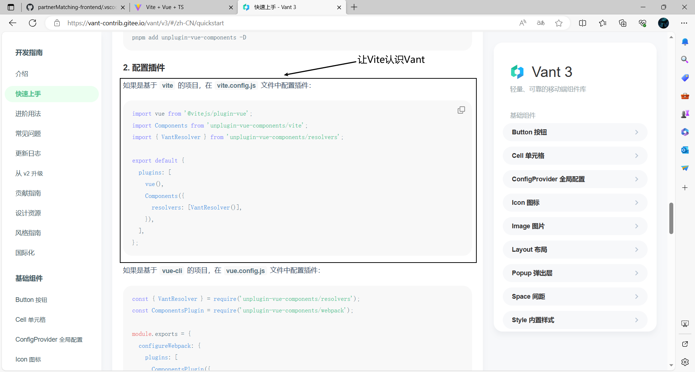
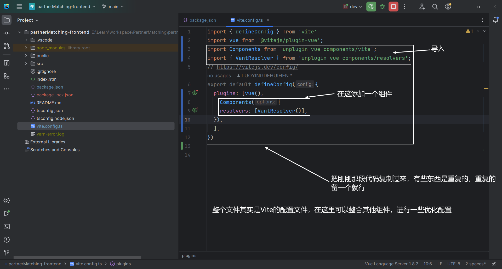
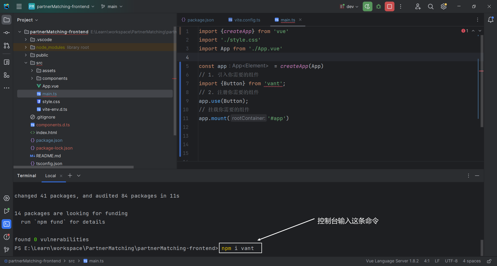
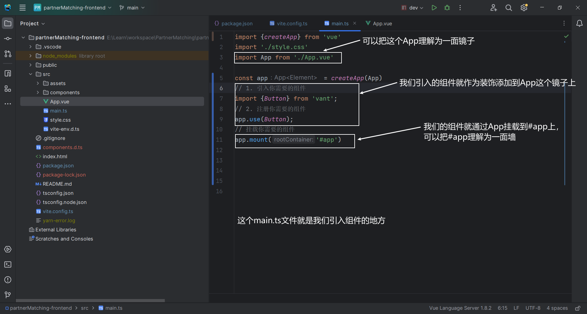
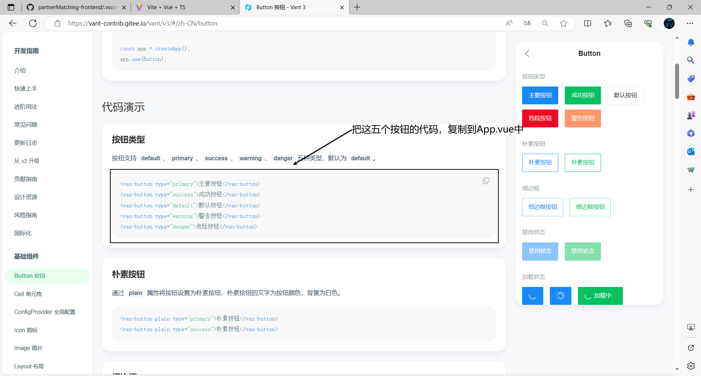
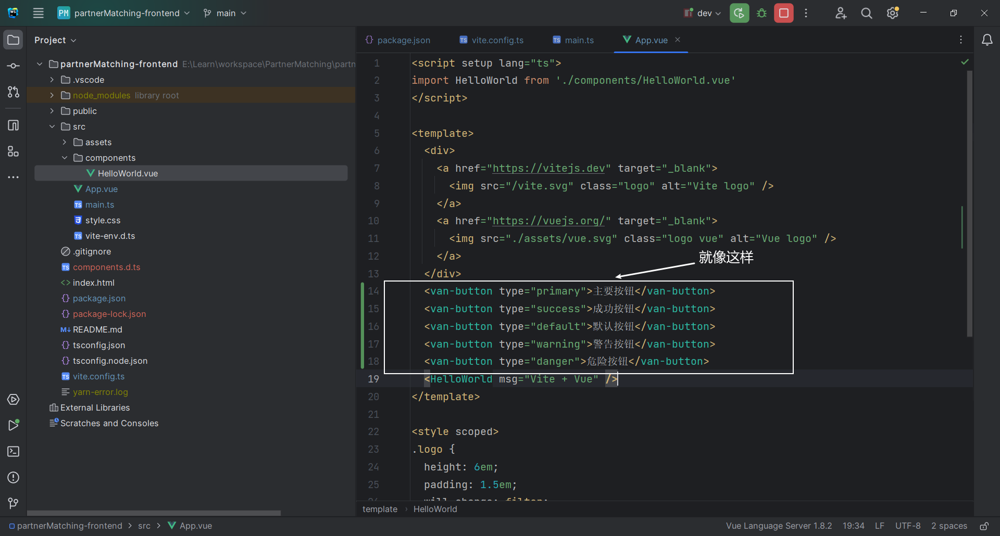

# 樱络 - 伙伴匹配系统

简介:帮助大家找到志同道合的伙伴，移动端的H5网页（尽量兼容PC端）

## 需求分析

1. 用户给自己添加标签；修改标签，系统根据标签对用户进行分类（有哪些标签，如何对标签进行分类）分类比如：学习方向，就业状态，理想城市，工作，大学等
2. 主动搜索：允许用户根据标签去搜索其他用户
   1. 把需要被搜索的数据加到Redis缓存

3. 组队（前端的同学想找后端的同学帮助自己完成后端，后端的同学也需要前端的同学帮助自己完成前端，需要帮助的同学就可以创建一个队伍，等待有缘人，只能由一方单向发起组队）
   1. 创建队伍
   2. 加入队伍
   3. 根据标签查询队伍
   4. 删除队伍
   5. 编辑队伍
   6. 邀请其他人
   7. 队伍人数由上限，但为了防止有人放鸽子，可以多加几个人作为替补

4. 推荐相似伙伴
   1. 使用相似度计算算法　＋　本地分布式（采用多线程）

## 技术选型

### 前端

1. Vue3框架（提高页面开发效率）
2. Vant UI组件库（基于Vue的移动端组件库）（它也有基于React的版本Zent）
3. Vite（打包工具，速度快）
4. Nginx 单机部署

### 后端

1. Java8 （编程语言）
2. Spring（依赖注入框架，管理Java对象，集成一些其他内容） 
3. SpringMvc （Web框架，提供接口访问，restful接口等能力）
4. Mybatis（Java操作数据库的框架，持久层框架，对JDBC的封装） 
5. Mybatis-Plus（对mybatis的增强，不用写SQL也能实现增删改查） 
6. SpringBoot（快速启动/快速集成项目，帮助管理Spring的配置，帮助整合框架） 
7. MySQL（数据库）
8. Redis（缓存，NoSQL）
9. Swagger + Knife4j 接口文档

## 计划

1. **前端项目初始化**
2. **前端主页 + 组件概览**

2. **数据库表设计**
   1. 标签表
   2. 用户表
3. **后端**
   1. 根据标签搜索用户
   2. 组队
   3. 用户修改
   4. 推荐
4. **前端**
   1. 根据标签搜索用户

## 前端项目初始化

**文档介绍**

### 脚手架初始化项目

使用[ Vue CLI ](https://cli.vuejs.org/zh/)或者[Vite 官方](https://cn.vitejs.dev/guide/)

本项目使用Vite

 

### 整合Vant组件库

1. 整合

2. 引入组件

